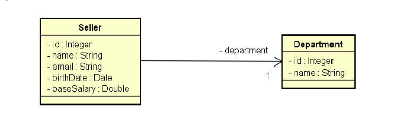
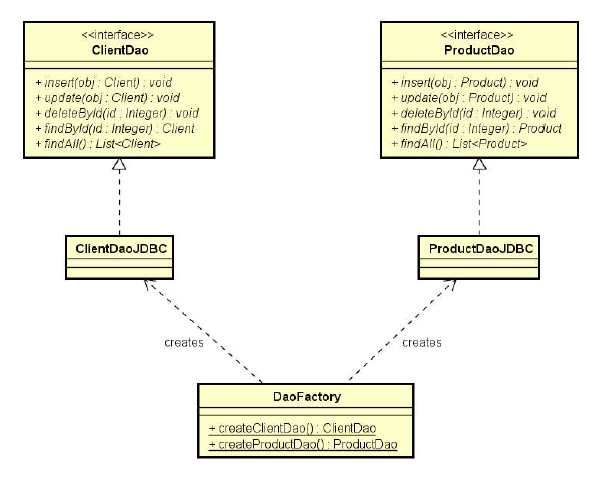

# Exercício de Demonstração de um CRUD usando o padrão DAO com JDBC

## Introdução

Este projeto foi desenvolvido como parte do **Curso Java Completo** ministrado pelo Prof. Dr. Nelio Alves na plataforma Udemy. Ele tem como objetivo a implementação manual de um CRUD (Create, Read, Update e Delete) completo de um banco de dados simples, utilizando o padrão **DAO (Data Access Object)** e a API **JDBC (Java Database Connectivity)**.

O repositório com as atividades relacionadas ao curso pode ser acessado [aqui](https://github.com/hvgofernandes/demo-dao-jdbc).

## Sobre o Projeto

O projeto consiste na implementação de um sistema para gerenciar um **cadastro de Vendedores e seus respectivos Departamentos**, permitindo realizar operações básicas de **CRUD (Create, Read, Update e Delete)**. Os dados são armazenados em um banco de dados MySQL, e a aplicação utiliza **JDBC** para manipular as informações.

## Estrutura do Projeto

O código está organizado em pacotes conforme a seguinte estrutura:

- **src**: Contém os pacotes e classes do projeto.
    - **model.entities**: Contém as classes de entidade do sistema.
        - `Department`: Representa a entidade Departamento.
        - `Seller`: Representa a entidade Vendedor.
    - **model.dao**: Contém as interfaces para as classes DAO.
        - `DepartmentDao`: Interface para a entidade Departamento.
        - `SellerDao`: Interface para a entidade Vendedor.
    - **model.dao.impl**: Contém as implementações das interfaces DAO.
        - `DepartmentDaoJDBC`: Implementação do DAO para Departamento utilizando JDBC.
        - `SellerDaoJDBC`: Implementação do DAO para Vendedor utilizando JDBC.
    - **db**: Contém as classes relacionadas à conexão com o banco de dados.
        - `DB`: Classe utilitária para configurar a conexão com o banco de dados.
        - `DbException`: Exceção personalizada para tratar erros do banco de dados.
        - `DaoFactory`: Classe responsável pela instância dos DAOs.
    - **db.properties**: Arquivo de configuração contendo as informações de acesso ao banco de dados.
    - **Demo.java**: Classe de demonstração com exemplos de uso das funcionalidades.

## Diagrama de Classes


## Padrão DAO


## Tecnologias Utilizadas

- **Java**
- **JDBC**
- **MySQL**

## Funcionalidades Implementadas

- Consultar vendedor por ID.
- Consultar todos os vendedores.
- Consultar vendedores por departamento.
- Inserir novo vendedor.
- Atualizar dados de um vendedor.
- Excluir um vendedor.
- Gerenciamento de **Departamentos**.

## Aprendizados

Durante o desenvolvimento deste projeto, foi possível aprofundar os conhecimentos sobre:

- Conexão de aplicações Java com bancos de dados usando JDBC.
- Implementação do padrão **DAO** para separação da lógica de persistência.
- Uso do padrão **Factory** para facilitar a criação de objetos DAO.

## Como Rodar o Projeto Localmente

1. Clone o repositório:
   ```bash
   git clone https://github.com/hvgofernandes/demo-dao-jdbc.git
   ```
2. Entre no diretório do projeto:
   ```bash
   cd demo-dao-jdbc
   ```
3. Configure o arquivo `db.properties` com as informações de acesso ao seu banco de dados MySQL.
4. Importe o projeto em sua IDE Java preferida (Eclipse, IntelliJ, etc.).
5. Certifique-se de que as dependências estão corretamente configuradas (por exemplo, MySQL Connector).
6. Rode a aplicação:
   ```bash
   java application/Program
   ```
   Ou, alternativamente:
   ```bash
   java application/Program2
   ```

